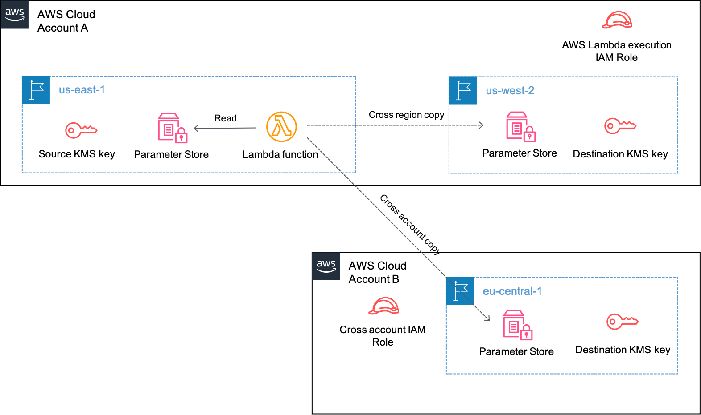

## Cross-Account and Cross-Region Migration of AWS Systems Manager Parameters

## Summary

Parameter store, a capability of AWS Systems Manager(SSM) provides secure, hierarchical storage for configuration data management and secrets management.

It is always recommended to create AWS Systems Manager parameters following the principles of Infrastructure as Code(IaC). This ensures parameters can be repeatedly deployed across multiple regions/accounts from a single template. However, as of this time AWS Systems Manager Parameter store does not natively support replicating parameters across AWS regions/accounts. If you run into a situation where you may have existing SSM parameters created previously that now need to be copied over to another region/account but no code scripts to fulfill that purpose, we have an APG pattern created for you.

The code in this repository is related to the APG pattern [Cross-Account and Cross-Region Migration of AWS Systems Manager Parameters](https://apg-library.amazonaws.com/content-viewer/author/ca6167e0-d53d-4623-80a4-91a94ef47af9) which provides detailed instructions on how to use the code.

At a high level, the pattern provides an AWS Lambda function code written and tested in Python 3.8 or later to handle -

- Copying existing AWS Systems Manager parameters to a different supported region in the same AWS account
- Copying existing AWS Systems Manager parameters to any cross account supported region


## Target Architecture

### TechnologyStack 

- AWS Systems Manager Parameter Store
- AWS Key Management Service (AWS KMS)
- AWS Identity and Access Management (AWS IAM)
- AWS Lambda



- The AWS Lambda function contains the function code ```copy-params.py``` and a user defined JSON file ```params.json```.
- A user defined JSON file ```params.json``` is input to the AWS Lambda function code.
- Based on the parameter names and other settings defined in the JSON file, the AWS Lambda function reads the parameters from AWS Systems Manager in the source region and migrates them to either another AWS region in the same account or cross account.
- AWS KMS is used to encrypt AWS Systems Manager parameters of type SecureString.
- AWS Lambda execution IAM role provides permissions to AWS Lambda function to perform AWS Systems Manager API calls written in the code for cross region copy.
- AWS Lambda function execution role assumes the cross account IAM role to perform AWS Systems Manager API calls written in the code for cross account copy.

## Security

See [CONTRIBUTING](CONTRIBUTING.md#security-issue-notifications) for more information.

## License

This library is licensed under the MIT-0 License. See the LICENSE file.

